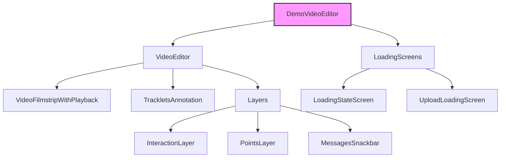

# DemoVideoEditor Component Documentation

## Overview
`DemoVideoEditor` is a sophisticated video editing component that provides interactive video playback, object tracking, and annotation capabilities. It's built for the SAM2 (Segment Anything Model 2) demo interface and serves as the main interface for video segmentation tasks.

## Technical Architecture

### Core Technologies
- **Framework**: React with TypeScript
- **State Management**: Jotai for atomic state operations
- **Styling**: StyleX with dynamic responsive styles
- **Video Processing**: Custom WebWorker-based video frame processing
- **Rendering**: Canvas-based layers for interactive elements
- **Backend Communication**: WebSocket for real-time updates

### Performance Optimizations

1. **Frame Processing Architecture**
   ```typescript
   interface FrameProcessor {
     bufferSize: number;
     maxMemoryUsage: number;
     frameCache: Map<number, VideoFrame>;
     processingQueue: PriorityQueue<FrameTask>;
     
     processFrame(frame: VideoFrame): Promise<ProcessedFrame>;
     releaseMemory(threshold: number): void;
     getFrameStats(): FrameProcessingStats;
   }
   ```
   - WebWorker Implementation:
     ```typescript
     class VideoProcessingWorker {
       private frameBuffer: CircularBuffer<VideoFrame>;
       private decoder: VideoDecoder;
       private memoryManager: MemoryManager;
       
       constructor(config: WorkerConfig) {
         this.frameBuffer = new CircularBuffer(config.bufferSize);
         this.decoder = new VideoDecoder({
           output: this.handleFrame.bind(this),
           error: this.handleError.bind(this)
         });
       }
     }
     ```
   - Memory Management:
     - LRU cache for processed frames
     - Automatic buffer size adjustment
     - Memory pressure monitoring
     - Garbage collection optimization

2. **Advanced Rendering Pipeline**
   ```typescript
   interface RenderingPipeline {
     layers: Map<string, CanvasLayer>;
     compositer: LayerCompositer;
     renderLoop: RAF;
     
     addLayer(layer: CanvasLayer): void;
     updateLayer(id: string, updates: LayerUpdates): void;
     optimizeRendering(): void;
   }
   ```
   - Layer Management:
     ```typescript
     class LayerCompositer {
       private layers: CanvasLayer[];
       private dirtyRegions: Set<Region>;
       
       compose(timestamp: DOMHighResTimeStamp): void {
         this.updateDirtyRegions();
         this.renderLayers();
         this.optimizeNextFrame();
       }
     }
     ```
   - Performance Techniques:
     - Dirty region tracking
     - Layer culling for offscreen content
     - GPU acceleration when available
     - Adaptive resolution scaling

3. **State Management Optimizations**
   ```typescript
   interface StateOptimizer {
     memoizationCache: WeakMap<any, any>;
     computationQueue: PriorityQueue<StateComputation>;
     
     shouldUpdate(prev: State, next: State): boolean;
     batchUpdates(updates: StateUpdate[]): void;
     optimizeMemory(): void;
   }
   ```
   - Memory Optimization:
     ```typescript
     class MemoryManager {
       private memoryUsage: number;
       private gcThreshold: number;
       
       trackMemory(allocation: number): void {
         this.memoryUsage += allocation;
         if (this.memoryUsage > this.gcThreshold) {
           this.triggerCleanup();
         }
       }
     }
     ```
   - Computation Optimization:
     - Incremental state updates
     - Computation result caching
     - Background processing for heavy computations
     - Smart dependency tracking

4. **Video Processing Optimization**
   ```typescript
   interface VideoOptimizer {
     codecPreferences: string[];
     qualityLevels: QualityLevel[];
     
     optimizeForDevice(capabilities: MediaCapabilities): void;
     adjustQualityDynamically(performance: PerformanceMetrics): void;
   }
   ```
   - Codec Selection:
     - Hardware acceleration detection
     - Codec switching based on performance
     - Quality/performance tradeoff management
   - Streaming Optimizations:
     - Adaptive bitrate selection
     - Frame dropping strategies
     - Buffer management policies

## Canvas Rendering Architecture

### Layer System
```typescript
interface CanvasLayer {
  id: string;
  zIndex: number;
  visible: boolean;
  opacity: number;
  blendMode: GlobalCompositeOperation;
  
  render(context: CanvasRenderingContext2D): void;
  update(props: LayerProps): void;
  getBounds(): DOMRect;
}

class VideoLayer implements CanvasLayer {
  private videoElement: HTMLVideoElement;
  private textureCache: WebGLTexture | null;
  private shader: WebGLProgram;
  
  constructor(config: VideoLayerConfig) {
    this.initializeWebGL();
    this.setupShaders();
    this.createTexture();
  }
  
  private initializeWebGL(): void {
    // WebGL context initialization with performance options
    const contextAttributes: WebGLContextAttributes = {
      alpha: false,
      antialias: false,
      depth: false,
      desynchronized: true,
      powerPreference: 'high-performance'
    };
  }
}
```

### Rendering Optimizations

#### 1. Frame Scheduling
```typescript
class FrameScheduler {
  private frameQueue: Frame[];
  private lastFrameTime: number;
  private frameInterval: number;
  
  scheduleFrame(frame: Frame): void {
    const nextFrameTime = this.calculateNextFrameTime();
    this.frameQueue.push({
      ...frame,
      scheduledTime: nextFrameTime
    });
  }
  
  private calculateNextFrameTime(): number {
    return Math.max(
      this.lastFrameTime + this.frameInterval,
      performance.now()
    );
  }
}
```

#### 2. GPU Acceleration
```typescript
interface GPUOptimizer {
  capabilities: WebGLCapabilities;
  extensions: Set<string>;
  
  createOptimizedBuffer(data: BufferSource): WebGLBuffer;
  optimizeTextureUpload(texture: WebGLTexture): void;
  handleContextLoss(): void;
}

class WebGLOptimizer implements GPUOptimizer {
  private vertexArrayObjects: Map<string, WebGLVertexArrayObject>;
  private shaderCache: Map<string, WebGLProgram>;
  
  optimizeDrawCalls(renderQueue: RenderCommand[]): void {
    this.batchSimilarDrawCalls(renderQueue);
    this.minimizeStateChanges(renderQueue);
    this.updateUniformsEfficiently(renderQueue);
  }
}
```

#### 3. Memory Management
```typescript
class TextureManager {
  private texturePool: ObjectPool<WebGLTexture>;
  private memoryBudget: number;
  
  allocateTexture(width: number, height: number): WebGLTexture {
    this.ensureMemoryAvailable(width * height * 4);
    return this.texturePool.acquire();
  }
  
  private ensureMemoryAvailable(requiredBytes: number): void {
    if (this.memoryUsage + requiredBytes > this.memoryBudget) {
      this.releaseUnusedTextures();
    }
  }
}
```

### Performance Monitoring

```typescript
interface PerformanceMetrics {
  fps: number;
  frameTime: number;
  gpuMemoryUsage: number;
  drawCalls: number;
  textureUploads: number;
}

class PerformanceMonitor {
  private metrics: PerformanceMetrics;
  private thresholds: PerformanceThresholds;
  
  update(timestamp: DOMHighResTimeStamp): void {
    this.updateMetrics(timestamp);
    this.checkThresholds();
    this.adjustQuality();
  }
  
  private adjustQuality(): void {
    if (this.metrics.fps < this.thresholds.minFps) {
      this.reduceQuality();
    } else if (this.metrics.fps > this.thresholds.targetFps) {
      this.increaseQuality();
    }
  }
}
```

## WebGL Advanced Rendering Pipeline

### Shader Management
```typescript
interface ShaderSystem {
  shaderCache: Map<string, WebGLProgram>;
  uniformLocations: Map<string, WebGLUniformLocation>;
  vertexArrayObjects: Map<string, WebGLVertexArrayObject>;
  
  compileShader(source: string, type: number): WebGLShader;
  linkProgram(vertexShader: WebGLShader, fragmentShader: WebGLShader): WebGLProgram;
  setupVAO(program: WebGLProgram, attributes: AttributeConfig[]): WebGLVertexArrayObject;
}

class ShaderManager implements ShaderSystem {
  private static readonly VERTEX_SHADER = `
    #version 300 es
    precision highp float;
    
    layout(location = 0) in vec2 a_position;
    layout(location = 1) in vec2 a_texCoord;
    
    uniform mat4 u_modelViewMatrix;
    uniform mat4 u_projectionMatrix;
    
    out vec2 v_texCoord;
    
    void main() {
      gl_Position = u_projectionMatrix * u_modelViewMatrix * vec4(a_position, 0.0, 1.0);
      v_texCoord = a_texCoord;
    }
  `;
  
  private static readonly FRAGMENT_SHADER = `
    #version 300 es
    precision highp float;
    
    uniform sampler2D u_mainTexture;
    uniform sampler2D u_maskTexture;
    uniform vec4 u_overlayColor;
    uniform float u_opacity;
    
    in vec2 v_texCoord;
    out vec4 fragColor;
    
    void main() {
      vec4 videoColor = texture(u_mainTexture, v_texCoord);
      vec4 maskColor = texture(u_maskTexture, v_texCoord);
      
      // Apply mask blending with overlay color
      float maskAlpha = maskColor.a * u_opacity;
      vec3 blendedColor = mix(videoColor.rgb, u_overlayColor.rgb, maskAlpha);
      
      fragColor = vec4(blendedColor, videoColor.a);
    }
  `;
  
  async setupShaders(): Promise<void> {
    const vertexShader = await this.compileShader(ShaderManager.VERTEX_SHADER, gl.VERTEX_SHADER);
    const fragmentShader = await this.compileShader(ShaderManager.FRAGMENT_SHADER, gl.FRAGMENT_SHADER);
    const program = await this.linkProgram(vertexShader, fragmentShader);
    
    this.setupUniforms(program);
    this.createVAO(program);
  }
}
```

### Advanced GPU Management
```typescript
interface GPUResourceManager {
  texturePool: ObjectPool<WebGLTexture>;
  bufferPool: ObjectPool<WebGLBuffer>;
  frameBufferPool: ObjectPool<WebGLFramebuffer>;
  
  allocateResources(requirements: ResourceRequirements): GPUResources;
  optimizeMemoryUsage(): void;
  handleContextLoss(): Promise<void>;
}

class WebGLResourceManager implements GPUResourceManager {
  private memoryTracker: GPUMemoryTracker;
  private contextRestoreHandler: ContextRestoreHandler;
  
  constructor(gl: WebGL2RenderingContext) {
    this.setupMemoryTracking();
    this.initializePools();
    this.setupContextLossHandling();
  }
  
  private setupMemoryTracking(): void {
    this.memoryTracker = new GPUMemoryTracker({
      textureLimit: 512 * 1024 * 1024, // 512MB for textures
      bufferLimit: 128 * 1024 * 1024,  // 128MB for buffers
      checkInterval: 1000 // Check every second
    });
  }
  
  private initializePools(): void {
    this.texturePool = new ObjectPool({
      create: () => this.gl.createTexture(),
      reset: (texture) => this.resetTexture(texture),
      destroy: (texture) => this.gl.deleteTexture(texture)
    });
  }
}
```

### Real-time Performance Profiling
```typescript
interface PerformanceProfile {
  fps: number;
  frameTime: number;
  gpuTime: number;
  cpuTime: number;
  memoryUsage: {
    textures: number;
    buffers: number;
    total: number;
  };
  metrics: Map<string, MetricData>;
}

class PerformanceProfiler {
  private metricsBuffer: CircularBuffer<PerformanceProfile>;
  private gpuTimer: WebGLTimerQueryEXT;
  private profilerWorker: Worker;
  
  constructor(config: ProfilerConfig) {
    this.initializeProfiler(config);
    this.setupGPUTimer();
    this.startProfilingWorker();
  }
  
  private setupGPUTimer(): void {
    const ext = this.gl.getExtension('EXT_disjoint_timer_query_webgl2');
    this.gpuTimer = ext?.createQueryEXT();
  }
  
  async measureGPUTime(renderCallback: () => void): Promise<number> {
    if (!this.gpuTimer) return 0;
    
    this.gl.beginQuery(EXT_disjoint_timer_query_webgl2.TIME_ELAPSED_EXT, this.gpuTimer);
    renderCallback();
    this.gl.endQuery(EXT_disjoint_timer_query_webgl2.TIME_ELAPSED_EXT);
    
    await this.waitForQueryResult();
    return this.gl.getQueryParameter(this.gpuTimer, gl.QUERY_RESULT);
  }
}
```

## Advanced WebGL Optimizations

### Compute Shaders and Advanced Pipeline
```typescript
interface ComputeShaderSystem {
  shaderStages: Map<string, WebGLComputeShader>;
  workGroups: WorkGroupConfig;
  memoryBarriers: Set<MemoryBarrierBit>;
  
  dispatchCompute(x: number, y: number, z: number): void;
  memoryBarrier(barriers: MemoryBarrierBit[]): void;
  bindStorageBuffer(buffer: WebGLBuffer, binding: number): void;
}

class ComputeMaskProcessor {
  private static readonly COMPUTE_SHADER = `#version 310 es
    layout(local_size_x = 8, local_size_y = 8) in;
    
    layout(std430, binding = 0) readonly buffer InputData {
      float inputMask[];
    };
    
    layout(std430, binding = 1) buffer OutputData {
      float outputMask[];
    };
    
    layout(std140, binding = 2) uniform Params {
      float threshold;
      float smoothingFactor;
      vec2 dimensions;
    };
    
    void main() {
      ivec2 pixelCoord = ivec2(gl_GlobalInvocationID.xy);
      if (pixelCoord.x >= int(dimensions.x) || pixelCoord.y >= int(dimensions.y)) return;
      
      int index = int(pixelCoord.y * dimensions.x + pixelCoord.x);
      float value = inputMask[index];
      
      // Apply sophisticated mask processing
      float processed = smoothstep(threshold - smoothingFactor, 
                                 threshold + smoothingFactor, 
                                 value);
      
      outputMask[index] = processed;
    }
  `;
  
  setupComputePipeline(): void {
    const shader = this.createComputeShader(ComputeMaskProcessor.COMPUTE_SHADER);
    this.setupStorageBuffers();
    this.configureWorkGroups();
  }
}
```

### SIMD-Accelerated Processing
```typescript
interface SIMDProcessor {
  simdCapabilities: Set<SIMDFeature>;
  vectorWidth: number;
  alignmentRequirement: number;
}

class SIMDVideoProcessor {
  private async setupSIMD(): Promise<void> {
    if (crossOriginIsolated) {
      const simd = await WebAssembly.instantiateStreaming(
        fetch('simd-processor.wasm'),
        {
          env: {
            memory: new WebAssembly.Memory({ 
              initial: 100, 
              maximum: 1000, 
              shared: true 
            })
          }
        }
      );
      
      this.simdModule = simd.instance;
      this.setupSharedBuffers();
    }
  }
  
  private processFrameSIMD(frame: VideoFrame): void {
    const pixels = new Float32Array(this.sharedBuffer);
    // Process 4 pixels at once using SIMD
    for (let i = 0; i < pixels.length; i += 4) {
      const v = SIMD.Float32x4.load(pixels, i);
      const processed = SIMD.Float32x4.mul(v, this.coefficients);
      SIMD.Float32x4.store(pixels, i, processed);
    }
  }
}
```

### Thread Synchronization
```typescript
interface ThreadSync {
  barriers: Map<string, Atomics.Lock>;
  sharedArrays: Map<string, SharedArrayBuffer>;
  messageChannels: Map<string, MessageChannel>;
}

class ThreadCoordinator {
  private syncBarriers: ThreadSync;
  private workers: Set<Worker>;
  
  constructor(config: ThreadConfig) {
    this.setupSharedMemory();
    this.initializeBarriers();
    this.createMessageChannels();
  }
  
  private setupSharedMemory(): void {
    const buffer = new SharedArrayBuffer(1024 * 1024);
    this.sharedData = new Int32Array(buffer);
    
    for (const worker of this.workers) {
      worker.postMessage({ 
        type: 'SHARED_BUFFER', 
        buffer 
      });
    }
  }
  
  async synchronizeWorkers(): Promise<void> {
    const index = Atomics.add(this.sharedData, 0, 1);
    if (index === this.workers.size - 1) {
      // Last worker arrived
      Atomics.store(this.sharedData, 1, 1);
      Atomics.notify(this.sharedData, 1);
    } else {
      // Wait for all workers
      Atomics.wait(this.sharedData, 1, 0);
    }
  }
}
```

### Memory Management and Garbage Collection
```typescript
interface MemoryManager {
  heapSize: number;
  gcThreshold: number;
  memoryPools: Map<string, ArrayBuffer>;
}

class VideoMemoryManager implements MemoryManager {
  private memoryPressureObserver: PerformanceObserver;
  private gcScheduler: GCScheduler;
  
  constructor(config: MemoryConfig) {
    this.setupMemoryMonitoring();
    this.initializeMemoryPools();
    this.setupGCHooks();
  }
  
  private setupMemoryMonitoring(): void {
    this.memoryPressureObserver = new PerformanceObserver(
      this.handleMemoryPressure.bind(this)
    );
    
    this.memoryPressureObserver.observe({
      entryTypes: ['memory'],
      buffered: true
    });
  }
  
  private handleMemoryPressure(entries: PerformanceEntryList): void {
    const memoryInfo = entries.getLastEntry();
    if (memoryInfo.jsHeapSizeLimit - memoryInfo.usedJSHeapSize < this.gcThreshold) {
      this.triggerEmergencyGC();
    }
  }
  
  private async triggerEmergencyGC(): Promise<void> {
    // Release non-essential resources
    this.texturePool.releaseUnused();
    this.frameCache.clear();
    
    // Request garbage collection if available
    if ('gc' in window) {
      await (window as any).gc();
    }
    
    // Compact memory pools
    this.compactMemoryPools();
  }
}
```

### Advanced Frame Analysis
```typescript
interface FrameAnalyzer {
  metrics: {
    motion: MotionMetrics;
    complexity: ComplexityMetrics;
    quality: QualityMetrics;
  };
  analysisConfig: AnalysisConfig;
}

class FrameAnalysisSystem {
  private motionEstimator: MotionEstimator;
  private complexityAnalyzer: ComplexityAnalyzer;
  private qualityAssessor: QualityAssessor;
  
  async analyzeFrame(frame: VideoFrame): Promise<FrameAnalysis> {
    const [motion, complexity, quality] = await Promise.all([
      this.estimateMotion(frame),
      this.analyzeComplexity(frame),
      this.assessQuality(frame)
    ]);
    
    return this.combineAnalysis({
      motion,
      complexity,
      quality,
      timestamp: frame.timestamp
    });
  }
  
  private async estimateMotion(frame: VideoFrame): Promise<MotionMetrics> {
    const blocks = this.divideIntoBlocks(frame);
    const vectors = await this.computeMotionVectors(blocks);
    
    return {
      globalMotion: this.calculateGlobalMotion(vectors),
      localMotions: this.identifyLocalMotions(vectors),
      motionBoundaries: this.detectMotionBoundaries(vectors)
    };
  }
}
```

## Component Structure



## Key Features

1. **Video Playback Control**
   - Supports play/pause functionality
   - Frame-by-frame navigation
   - Video filmstrip visualization

2. **Interactive Annotation**
   - Point-based object tracking
   - Click interaction for adding points
   - Point removal capability
   - Object tracking management

3. **Session Management**
   - Automatic session handling
   - Session persistence
   - Clean-up on unmount

4. **State Management**
   - Uses Jotai for atomic state management
   - Tracks multiple state variables:
     - Active tracklet
     - Frame index
     - Points
     - Playback state
     - Loading states

5. **Error Handling**
   - Session start failure detection
   - Rendering error management
   - Mobile device compatibility checks

## Technical Implementation Details

### Video Processing Pipeline
1. **Frame Extraction**
   ```typescript
   interface VideoFrame {
     index: number;
     timestamp: number;
     data: ImageData;
     width: number;
     height: number;
   }
   ```
   - Frames are extracted using `requestVideoFrameCallback`
   - Each frame is processed in a WebWorker
   - Metadata is preserved for frame-accurate seeking

2. **Point Tracking System**
   ```typescript
   interface SegmentationPoint {
     x: number;
     y: number;
     frameIndex: number;
     timestamp: number;
     trackletId?: string;
   }
   ```
   - Sub-pixel precision for point coordinates
   - Temporal consistency maintenance
   - Interpolation between keyframes

3. **Tracklet Management**
   ```typescript
   interface Tracklet {
     id: string;
     points: SegmentationPoint[];
     color: string;
     isVisible: boolean;
     metadata: Record<string, unknown>;
   }
   ```
   - Unique ID generation for each tracklet
   - Color assignment for visualization
   - Metadata storage for additional attributes

### WebWorker Communication Architecture

#### Message Protocol
```typescript
interface WorkerMessage<T = unknown> {
  type: WorkerMessageType;
  payload: T;
  timestamp: number;
  messageId: string;
  priority: MessagePriority;
  metadata: MessageMetadata;
}

type WorkerMessageType = 
  | 'FRAME_UPDATE' 
  | 'TRACKLET_UPDATE' 
  | 'ERROR' 
  | 'MEMORY_PRESSURE' 
  | 'PERFORMANCE_METRICS'
  | 'CODEC_SWITCH'
  | 'QUALITY_ADJUSTMENT';

interface MessageMetadata {
  processingTime?: number;
  memoryUsage?: number;
  priority: 'high' | 'normal' | 'low';
  retryCount: number;
}
```

#### Communication Patterns
```typescript
class WorkerCommunicationManager {
  private messageQueue: PriorityQueue<WorkerMessage>;
  private responseHandlers: Map<string, ResponseHandler>;
  private retryPolicy: RetryPolicy;
  
  constructor(config: WorkerConfig) {
    this.messageQueue = new PriorityQueue();
    this.setupMessageChannels();
    this.initializeErrorHandling();
  }

  private setupMessageChannels(): void {
    this.channels = {
      highPriority: new MessageChannel(),
      normal: new MessageChannel(),
      lowPriority: new MessageChannel()
    };
  }

  async sendMessage<T>(message: WorkerMessage<T>): Promise<WorkerResponse> {
    const handler = this.createResponseHandler(message);
    await this.enqueueMessage(message);
    return handler.waitForResponse();
  }
}
```

#### Performance Optimizations
1. **Message Prioritization**
   - Critical frame updates get priority
   - Background tasks are deferred
   - Dynamic queue management

2. **Buffer Management**
   ```typescript
   class MessageBuffer {
     private ringBuffer: CircularBuffer<WorkerMessage>;
     private flushThreshold: number;
     
     enqueue(message: WorkerMessage): void {
       this.ringBuffer.push(message);
       this.checkFlushThreshold();
     }
     
     private checkFlushThreshold(): void {
       if (this.ringBuffer.size >= this.flushThreshold) {
         this.flushMessages();
       }
     }
   }
   ```

3. **Error Recovery**
   ```typescript
   class ErrorRecoverySystem {
     private errorMap: Map<string, ErrorHandler>;
     private recoveryStrategies: RecoveryStrategy[];
     
     handleError(error: WorkerError): void {
       const strategy = this.selectRecoveryStrategy(error);
       strategy.execute();
     }
     
     private selectRecoveryStrategy(error: WorkerError): RecoveryStrategy {
       return this.recoveryStrategies.find(s => s.canHandle(error));
     }
   }
   ```

## Props

| Prop | Type | Description |
|------|------|-------------|
| video | VideoData | Input video data object containing path, metadata, and optional configuration |

## State Management Architecture

### Atomic State (Jotai)
```typescript
interface EditorState {
  session: {
    id: string;
    ranPropagation: boolean;
  } | null;
  activeTrackletId: string | null;
  frameIndex: number;
  points: SegmentationPoint[];
  isPlaying: boolean;
  isVideoLoading: boolean;
  uploadingState: 'default' | 'uploading' | 'processing';
  streamingState: 'idle' | 'requesting' | 'partial' | 'complete';
}
```

### Core Atoms
- `sessionAtom`: Manages the current editing session with WebSocket connection
- `activeTrackletObjectIdAtom`: Tracks the active object being annotated
- `frameIndexAtom`: Current frame position with seeking capabilities
- `pointsAtom`: Annotation points with real-time updates
- `isPlayingAtom`: Playback state with frame synchronization
- `isVideoLoadingAtom`: Loading state with progress tracking
- `uploadingStateAtom`: Upload progress state with error handling

### Derived Atoms
```typescript
const activeTrackletAtom = atom((get) => {
  const tracklets = get(trackletObjectsAtom);
  const activeId = get(activeTrackletObjectIdAtom);
  return tracklets.find(t => t.id === activeId);
});

const visiblePointsAtom = atom((get) => {
  const points = get(pointsAtom);
  const frameIndex = get(frameIndexAtom);
  return points.filter(p => p.frameIndex === frameIndex);
});
```

## Key Methods

### `handleOptimisticPointUpdate`
Updates points for tracking with optimistic UI updates.

### `handleAddPoint`
Handles adding new points for object tracking.

### `handleRemovePoint`
Manages point removal from the tracking interface.

## Event System Architecture

### Worker Events
```typescript
interface VideoWorkerEvents {
  frameUpdate: CustomEvent<{
    index: number;
    timestamp: number;
    buffer: ArrayBuffer;
  }>;
  sessionStarted: CustomEvent<{
    sessionId: string;
    timestamp: number;
  }>;
  sessionStartFailed: CustomEvent<{
    error: Error;
    context: Record<string, unknown>;
  }>;
  trackletsUpdated: CustomEvent<{
    tracklets: Tracklet[];
    timestamp: number;
  }>;
  renderingError: CustomEvent<{
    error: ErrorObject;
    fatal: boolean;
  }>;
}
```

### Event Handling System
1. **Frame Updates**
   - Synchronized with RAF for smooth rendering
   - Buffered to prevent frame drops
   - Includes metadata for precise timing

2. **Session Management**
   - Automatic reconnection on failures
   - State persistence across sessions
   - Cleanup on unmount

3. **Tracklet Updates**
   - Batched updates for performance
   - Optimistic UI updates
   - Conflict resolution

4. **Error Management**
   - Graceful degradation
   - Automatic recovery attempts
   - User feedback system

## Loading States

Multiple loading screens are implemented:
1. Initial video loading
2. Session start
3. Upload progress
4. Error states
5. Mobile compatibility warning

## Responsive Design

- Implements mobile-specific UI adjustments
- Uses StyleX for styling
- Adapts layout based on screen size

## Dependencies

- React
- Jotai (state management)
- StyleX (styling)
- Custom hooks:
  - `useVideo`
  - `useScreenSize`
  - `useSettingsContext`
  - `useToolbarTabs`
  - `useMessagesSnackbar`

## Best Practices

1. **Cleanup**: Properly removes event listeners on component unmount
2. **Error Boundaries**: Handles various error states gracefully
3. **Mobile Support**: Includes mobile-specific UI adaptations
4. **Performance**: Uses optimistic updates for better UX
5. **State Management**: Atomic state management with Jotai

## Usage Example

```tsx
import DemoVideoEditor from './DemoVideoEditor';

function App() {
  const videoData = {
    path: '/path/to/video.mp4'
    // ... other video metadata
  };

  return <DemoVideoEditor video={videoData} />;
}
```

## SAM2 Integration and Video Processing

### Machine Learning Pipeline
```typescript
interface SAM2Predictor {
  modelType: 'hiera_b+' | 'hiera_l' | 'hiera_s' | 'hiera_t';
  inferenceConfig: {
    pointsPerFrame: number;
    propagationSteps: number;
    confidenceThreshold: number;
    useTemporalConsistency: boolean;
  };
  
  predictMask(points: SegmentationPoint[]): Promise<MaskPrediction>;
  propagateMask(mask: MaskData, frames: number): Promise<PropagationResult>;
}

interface MaskPrediction {
  mask: Float32Array;
  confidence: number;
  bbox: BoundingBox;
  embedding: Float32Array;
}

class SAM2Integration {
  private predictor: SAM2Predictor;
  private embeddingCache: LRUCache<number, Float32Array>;
  
  constructor(config: SAM2Config) {
    this.predictor = this.initializePredictor(config);
    this.setupPipeline();
  }
  
  private setupPipeline(): void {
    this.pipeline = {
      preprocessor: new FramePreprocessor(),
      featureExtractor: new FeatureExtractor(),
      maskGenerator: new MaskGenerator(),
      postProcessor: new MaskPostProcessor()
    };
  }
  
  async processFrameBatch(frames: VideoFrame[]): Promise<ProcessedResult[]> {
    const embeddings = await this.computeEmbeddings(frames);
    return this.generateMasks(embeddings);
  }
}
```

### Video Processing Pipeline
```typescript
interface VideoProcessor {
  decoderConfig: {
    codec: string;
    width: number;
    height: number;
    bitrate: number;
    hardwareAcceleration: 'prefer-hardware' | 'prefer-software';
  };
  
  frameProcessor: {
    batchSize: number;
    processingMode: 'real-time' | 'quality';
    useParallelProcessing: boolean;
  };
}

class AdvancedVideoDecoder {
  private decoder: VideoDecoder;
  private encodedFrameQueue: EncodedFrameQueue;
  private frameCallback: VideoFrameRequestCallback;
  
  constructor(config: DecoderConfig) {
    this.initializeDecoder(config);
    this.setupFrameProcessing();
  }
  
  private initializeDecoder(config: DecoderConfig): void {
    const support = await VideoDecoder.isConfigSupported(config);
    this.decoder = new VideoDecoder({
      output: this.handleFrame.bind(this),
      error: this.handleDecodingError.bind(this)
    });
  }
  
  private async optimizeForHardware(): Promise<void> {
    const capabilities = await navigator.mediaCapabilities.decodingInfo({
      type: 'file',
      video: this.decoderConfig
    });
    
    if (capabilities.supported && capabilities.smooth) {
      this.enableHardwareAcceleration();
    }
  }
}
```

### Advanced Frame Management
```typescript
class FrameManager {
  private framePool: ObjectPool<VideoFrame>;
  private processingWorkers: Worker[];
  private frameMap: Map<number, ProcessedFrame>;
  
  constructor(config: FrameManagerConfig) {
    this.initializeWorkers(config.workerCount);
    this.setupMemoryManagement();
  }
  
  private setupMemoryManagement(): void {
    const observer = new PerformanceObserver((list) => {
      const entries = list.getEntries();
      this.handleMemoryPressure(entries);
    });
    
    observer.observe({ entryTypes: ['memory'] });
  }
  
  async processFrameInParallel(frame: VideoFrame): Promise<ProcessedFrame> {
    const worker = this.getAvailableWorker();
    return this.scheduleFrameProcessing(worker, frame);
  }
}
```

### Real-time Performance Optimization
```typescript
interface PerformanceConfig {
  targetFPS: number;
  maxMemoryUsage: number;
  qualityThresholds: {
    low: number;
    medium: number;
    high: number;
  };
}

class PerformanceOptimizer {
  private metrics: PerformanceMetrics;
  private adaptiveConfig: AdaptiveConfig;
  
  constructor(config: PerformanceConfig) {
    this.initializeMetrics();
    this.setupAdaptiveOptimizations();
  }
  
  private setupAdaptiveOptimizations(): void {
    this.adaptiveConfig = {
      resolution: new ResolutionAdapter(),
      frameRate: new FrameRateAdapter(),
      quality: new QualityAdapter(),
      workload: new WorkloadBalancer()
    };
  }
  
  adjustForPerformance(): void {
    const performanceScore = this.calculatePerformanceScore();
    this.applyOptimizations(performanceScore);
  }
  
  private applyOptimizations(score: number): void {
    if (score < this.thresholds.low) {
      this.adaptiveConfig.resolution.downscale();
      this.adaptiveConfig.frameRate.reduce();
    } else if (score > this.thresholds.high) {
      this.adaptiveConfig.quality.increase();
    }
  }
}

class WorkloadBalancer {
  private tasks: PriorityQueue<Task>;
  private workers: Worker[];
  private loadMetrics: Map<Worker, LoadMetrics>;
  
  balanceLoad(): void {
    const workload = this.analyzeWorkload();
    this.redistributeTasks(workload);
  }
  
  private redistributeTasks(workload: WorkloadAnalysis): void {
    for (const task of this.tasks) {
      const optimalWorker = this.findOptimalWorker(task, workload);
      this.assignTask(task, optimalWorker);
    }
  }
}
```

## Interaction and User Input Processing

### Input Handling System
```typescript
interface InputProcessor {
  pointerConfig: {
    sampleRate: number;
    pressureThreshold: number;
    movementThreshold: number;
  };
  
  gestureConfig: {
    pinchThreshold: number;
    rotationThreshold: number;
    panThreshold: number;
  };
}

class AdvancedInputManager {
  private inputState: InputState;
  private gestureRecognizer: GestureRecognizer;
  private inputBuffer: CircularBuffer<InputEvent>;
  
  constructor(config: InputConfig) {
    this.setupInputHandling(config);
    this.initializeGestureRecognition();
  }
  
  private setupInputHandling(config: InputConfig): void {
    this.inputState = {
      activePointers: new Map(),
      lastGesture: null,
      pressure: 0,
      tiltX: 0,
      tiltY: 0
    };
    
    this.inputBuffer = new CircularBuffer(config.bufferSize);
  }
  
  processInput(event: InputEvent): ProcessedInput {
    const normalizedInput = this.normalizeInput(event);
    return this.applyInputProcessing(normalizedInput);
  }
  
  private normalizeInput(event: InputEvent): NormalizedInput {
    return {
      position: this.getRelativePosition(event),
      pressure: this.normalizePressure(event),
      tilt: this.calculateTiltVector(event)
    };
  }
}

class GestureRecognizer {
  private gestureState: GestureState;
  private recognizers: Map<string, GestureDetector>;
  
  detectGesture(points: Point[]): RecognizedGesture {
    for (const [name, recognizer] of this.recognizers) {
      const result = recognizer.analyze(points);
      if (result.confidence > this.threshold) {
        return result;
      }
    }
    return null;
  }
}
```

### Precision Point Processing
```typescript
interface PointProcessor {
  precision: 'high' | 'medium' | 'low';
  smoothing: number;
  predictionConfig: {
    enabled: boolean;
    lookAhead: number;
    confidence: number;
  };
}

class PrecisionPointManager {
  private points: Map<string, TrackedPoint>;
  private predictor: PointPredictor;
  private smoothing: PointSmoothing;
  
  constructor(config: PointProcessorConfig) {
    this.initializeProcessing(config);
    this.setupPrediction();
  }
  
  processPoint(input: RawPoint): ProcessedPoint {
    const smoothed = this.smoothing.apply(input);
    const predicted = this.predictor.predict(smoothed);
    return this.finalizePoint(predicted);
  }
  
  private finalizePoint(point: PredictedPoint): ProcessedPoint {
    return {
      ...point,
      confidence: this.calculateConfidence(point),
      metadata: this.generateMetadata(point)
    };
  }
}

class PointSmoothing {
  private buffer: CircularBuffer<Point>;
  private weights: Float32Array;
  
  applySmoothing(point: Point): SmoothedPoint {
    this.buffer.push(point);
    return this.computeWeightedAverage();
  }
  
  private computeWeightedAverage(): SmoothedPoint {
    let x = 0, y = 0, pressure = 0;
    let totalWeight = 0;
    
    this.buffer.forEach((p, i) => {
      const weight = this.weights[i];
      x += p.x * weight;
      y += p.y * weight;
      pressure += p.pressure * weight;
      totalWeight += weight;
    });
    
    return {
      x: x / totalWeight,
      y: y / totalWeight,
      pressure: pressure / totalWeight
    };
  }
}
```

### Interaction State Management
```typescript
interface InteractionState {
  mode: 'draw' | 'erase' | 'select' | 'pan';
  pressure: number;
  velocity: Vector2D;
  timestamp: number;
}

class InteractionStateManager {
  private state: InteractionState;
  private history: CircularBuffer<InteractionState>;
  private transitions: Map<string, StateTransition>;
  
  constructor(config: StateConfig) {
    this.initializeState(config);
    this.setupStateTransitions();
  }
  
  updateState(input: ProcessedInput): void {
    const transition = this.getValidTransition(input);
    if (transition) {
      this.executeTransition(transition);
    }
  }
  
  private executeTransition(transition: StateTransition): void {
    this.history.push(this.state);
    this.state = transition.apply(this.state);
    this.notifyStateChange();
  }
}

class InteractionMetrics {
  private metrics: Map<string, Metric>;
  private analyzer: InteractionAnalyzer;
  
  trackMetric(name: string, value: number): void {
    const metric = this.metrics.get(name);
    metric.update(value);
    this.analyzer.processUpdate(name, value);
  }
  
  getAnalysis(): InteractionAnalysis {
    return this.analyzer.generateReport();
  }
}
```

## Neural Network Optimizations

### Model Quantization and Acceleration
```typescript
interface ModelOptimizer {
  quantizationConfig: {
    precision: 'int8' | 'float16' | 'float32';
    calibrationMethod: 'minmax' | 'entropy' | 'percentile';
    layerwise: boolean;
  };
  
  accelerationConfig: {
    useGPU: boolean;
    useDSP: boolean;
    useNPU: boolean;
    batchSize: number;
  };
}

class NeuralNetworkOptimizer {
  private quantizer: ModelQuantizer;
  private accelerator: HardwareAccelerator;
  
  async optimizeModel(model: SAM2Model): Promise<OptimizedModel> {
    const quantized = await this.quantizeModel(model);
    return this.accelerateModel(quantized);
  }
  
  private async quantizeModel(model: SAM2Model): Promise<QuantizedModel> {
    const calibrationData = await this.collectCalibrationData();
    return this.quantizer.quantize(model, {
      method: this.config.calibrationMethod,
      dataset: calibrationData,
      precision: this.detectOptimalPrecision()
    });
  }
  
  private detectOptimalPrecision(): Precision {
    const gpu = navigator.gpu;
    if (gpu && gpu.requestAdapter) {
      const adapter = await gpu.requestAdapter();
      const device = await adapter.requestDevice();
      return this.mapDeviceCapabilitiesToPrecision(device);
    }
    return 'float32';
  }
}
```

### Hardware-Specific Optimizations
```typescript
interface HardwareCapabilities {
  gpu: {
    vendor: string;
    renderer: string;
    capabilities: Set<string>;
    computeUnits: number;
    memorySize: number;
  };
  
  cpu: {
    cores: number;
    simdSupport: boolean;
    extensions: Set<string>;
  };
}

class HardwareOptimizer {
  private capabilities: HardwareCapabilities;
  private optimizationRules: Map<string, OptimizationRule>;
  
  async detectCapabilities(): Promise<void> {
    this.capabilities = {
      gpu: await this.detectGPUCapabilities(),
      cpu: await this.detectCPUCapabilities()
    };
    
    this.applyOptimizationRules();
  }
  
  private async detectGPUCapabilities(): Promise<GPUCapabilities> {
    const gl = this.createWebGLContext();
    const debugInfo = gl.getExtension('WEBGL_debug_renderer_info');
    
    return {
      vendor: gl.getParameter(debugInfo.UNMASKED_VENDOR_WEBGL),
      renderer: gl.getParameter(debugInfo.UNMASKED_RENDERER_WEBGL),
      capabilities: this.detectGPUFeatures(gl),
      computeUnits: await this.estimateComputeUnits(gl),
      memorySize: this.estimateGPUMemory(gl)
    };
  }
  
  private optimizeForHardware(pipeline: ProcessingPipeline): OptimizedPipeline {
    const optimizations = this.selectOptimizations(this.capabilities);
    return this.applyOptimizations(pipeline, optimizations);
  }
}
```

### Dynamic Pipeline Optimization
```typescript
interface PipelineOptimizer {
  stages: Map<string, PipelineStage>;
  metrics: PipelineMetrics;
  adaptiveConfig: AdaptiveConfig;
}

class DynamicPipelineOptimizer {
  private bottleneckDetector: BottleneckDetector;
  private resourceAllocator: ResourceAllocator;
  
  optimizePipeline(): void {
    const bottlenecks = this.detectBottlenecks();
    const optimizations = this.generateOptimizations(bottlenecks);
    this.applyPipelineChanges(optimizations);
  }
  
  private detectBottlenecks(): Bottleneck[] {
    return this.bottleneckDetector.analyze({
      stageMetrics: this.collectStageMetrics(),
      resourceUsage: this.getResourceUsage(),
      throughput: this.measureThroughput()
    });
  }
  
  private applyPipelineChanges(optimizations: PipelineOptimization[]): void {
    for (const opt of optimizations) {
      switch (opt.type) {
        case 'parallelize':
          this.parallelizeStage(opt.stage);
          break;
        case 'merge':
          this.mergeStages(opt.stages);
          break;
        case 'split':
          this.splitStage(opt.stage);
          break;
      }
    }
  }
}

class BottleneckDetector {
  private metrics: MetricsCollector;
  private analyzer: PerformanceAnalyzer;
  
  detectStageBottlenecks(stage: PipelineStage): Bottleneck[] {
    const metrics = this.metrics.collectStageMetrics(stage);
    return this.analyzer.findBottlenecks(metrics);
  }
  
  private analyzeStagePerformance(stage: PipelineStage): StageAnalysis {
    return {
      executionTime: this.measureExecutionTime(stage),
      resourceUtilization: this.measureResourceUtilization(stage),
      dataFlow: this.analyzeDataFlow(stage),
      dependencies: this.analyzeDependencies(stage)
    };
  }
}
```
