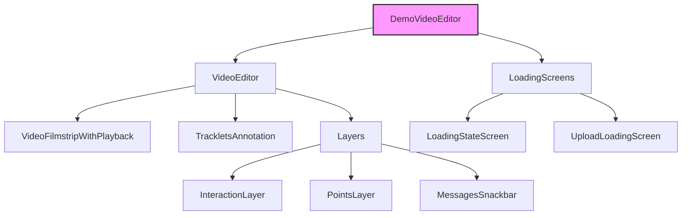

# DemoVideoEditor Component Documentation

## Overview
`DemoVideoEditor` is a sophisticated video editing component that provides interactive video playback, object tracking, and annotation capabilities. It's built for the SAM2 (Segment Anything Model 2) demo interface.

## Component Structure



## Key Features

1. **Video Playback Control**
   - Supports play/pause functionality
   - Frame-by-frame navigation
   - Video filmstrip visualization

2. **Interactive Annotation**
   - Point-based object tracking
   - Click interaction for adding points
   - Point removal capability
   - Object tracking management

3. **Session Management**
   - Automatic session handling
   - Session persistence
   - Clean-up on unmount

4. **State Management**
   - Uses Jotai for atomic state management
   - Tracks multiple state variables:
     - Active tracklet
     - Frame index
     - Points
     - Playback state
     - Loading states

5. **Error Handling**
   - Session start failure detection
   - Rendering error management
   - Mobile device compatibility checks

## Props

| Prop | Type | Description |
|------|------|-------------|
| video | VideoData | Input video data object |

## State Management

The component uses several atoms from Jotai:
- `sessionAtom`: Manages the current editing session
- `activeTrackletObjectIdAtom`: Tracks the active object being annotated
- `frameIndexAtom`: Current frame position
- `pointsAtom`: Annotation points
- `isPlayingAtom`: Playback state
- `isVideoLoadingAtom`: Loading state
- `uploadingStateAtom`: Upload progress state

## Key Methods

### `handleOptimisticPointUpdate`
Updates points for tracking with optimistic UI updates.

### `handleAddPoint`
Handles adding new points for object tracking.

### `handleRemovePoint`
Manages point removal from the tracking interface.

## Event Handling

The component listens to several events:
- `frameUpdate`: Updates frame index
- `sessionStarted`: Initializes new sessions
- `sessionStartFailed`: Handles session failures
- `trackletsUpdated`: Updates tracking objects
- `renderingError`: Manages rendering errors

## Loading States

Multiple loading screens are implemented:
1. Initial video loading
2. Session start
3. Upload progress
4. Error states
5. Mobile compatibility warning

## Responsive Design

- Implements mobile-specific UI adjustments
- Uses StyleX for styling
- Adapts layout based on screen size

## Dependencies

- React
- Jotai (state management)
- StyleX (styling)
- Custom hooks:
  - `useVideo`
  - `useScreenSize`
  - `useSettingsContext`
  - `useToolbarTabs`
  - `useMessagesSnackbar`

## Best Practices

1. **Cleanup**: Properly removes event listeners on component unmount
2. **Error Boundaries**: Handles various error states gracefully
3. **Mobile Support**: Includes mobile-specific UI adaptations
4. **Performance**: Uses optimistic updates for better UX
5. **State Management**: Atomic state management with Jotai

## Usage Example

```tsx
import DemoVideoEditor from './DemoVideoEditor';

function App() {
  const videoData = {
    path: '/path/to/video.mp4'
    // ... other video metadata
  };

  return <DemoVideoEditor video={videoData} />;
}
```
