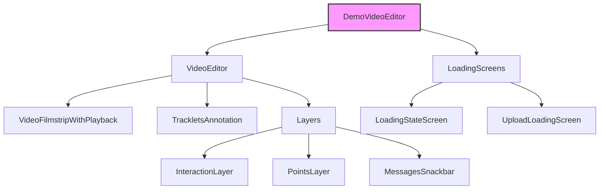

# DemoVideoEditor Component Documentation

## Overview
`DemoVideoEditor` is a sophisticated video editing component that provides interactive video playback, object tracking, and annotation capabilities. It's built for the SAM2 (Segment Anything Model 2) demo interface and serves as the main interface for video segmentation tasks.

## Technical Architecture

### Core Technologies
- **Framework**: React with TypeScript
- **State Management**: Jotai for atomic state operations
- **Styling**: StyleX with dynamic responsive styles
- **Video Processing**: Custom WebWorker-based video frame processing
- **Rendering**: Canvas-based layers for interactive elements
- **Backend Communication**: WebSocket for real-time updates

### Performance Optimizations
1. **Frame Processing**
   - Offloaded to WebWorker thread
   - Frame buffering for smooth playback
   - Asynchronous frame decoding
   - Memory-efficient frame storage

2. **Rendering Pipeline**
   - Multi-layered canvas architecture
   - Optimistic UI updates for point interactions
   - RAF (RequestAnimationFrame) synchronized updates
   - Layer compositing for efficient redraws

3. **State Management**
   - Atomic updates to prevent unnecessary rerenders
   - Memoized computations for heavy operations
   - Lazy loading of video segments
   - Efficient memory cleanup

## Component Structure



## Key Features

1. **Video Playback Control**
   - Supports play/pause functionality
   - Frame-by-frame navigation
   - Video filmstrip visualization

2. **Interactive Annotation**
   - Point-based object tracking
   - Click interaction for adding points
   - Point removal capability
   - Object tracking management

3. **Session Management**
   - Automatic session handling
   - Session persistence
   - Clean-up on unmount

4. **State Management**
   - Uses Jotai for atomic state management
   - Tracks multiple state variables:
     - Active tracklet
     - Frame index
     - Points
     - Playback state
     - Loading states

5. **Error Handling**
   - Session start failure detection
   - Rendering error management
   - Mobile device compatibility checks

## Technical Implementation Details

### Video Processing Pipeline
1. **Frame Extraction**
   ```typescript
   interface VideoFrame {
     index: number;
     timestamp: number;
     data: ImageData;
     width: number;
     height: number;
   }
   ```
   - Frames are extracted using `requestVideoFrameCallback`
   - Each frame is processed in a WebWorker
   - Metadata is preserved for frame-accurate seeking

2. **Point Tracking System**
   ```typescript
   interface SegmentationPoint {
     x: number;
     y: number;
     frameIndex: number;
     timestamp: number;
     trackletId?: string;
   }
   ```
   - Sub-pixel precision for point coordinates
   - Temporal consistency maintenance
   - Interpolation between keyframes

3. **Tracklet Management**
   ```typescript
   interface Tracklet {
     id: string;
     points: SegmentationPoint[];
     color: string;
     isVisible: boolean;
     metadata: Record<string, unknown>;
   }
   ```
   - Unique ID generation for each tracklet
   - Color assignment for visualization
   - Metadata storage for additional attributes

### WebWorker Communication
```typescript
interface WorkerMessage {
  type: 'FRAME_UPDATE' | 'TRACKLET_UPDATE' | 'ERROR';
  payload: unknown;
  timestamp: number;
}
```
- Structured message passing
- Error handling with recovery
- Buffered updates for performance

## Props

| Prop | Type | Description |
|------|------|-------------|
| video | VideoData | Input video data object containing path, metadata, and optional configuration |

## State Management Architecture

### Atomic State (Jotai)
```typescript
interface EditorState {
  session: {
    id: string;
    ranPropagation: boolean;
  } | null;
  activeTrackletId: string | null;
  frameIndex: number;
  points: SegmentationPoint[];
  isPlaying: boolean;
  isVideoLoading: boolean;
  uploadingState: 'default' | 'uploading' | 'processing';
  streamingState: 'idle' | 'requesting' | 'partial' | 'complete';
}
```

### Core Atoms
- `sessionAtom`: Manages the current editing session with WebSocket connection
- `activeTrackletObjectIdAtom`: Tracks the active object being annotated
- `frameIndexAtom`: Current frame position with seeking capabilities
- `pointsAtom`: Annotation points with real-time updates
- `isPlayingAtom`: Playback state with frame synchronization
- `isVideoLoadingAtom`: Loading state with progress tracking
- `uploadingStateAtom`: Upload progress state with error handling

### Derived Atoms
```typescript
const activeTrackletAtom = atom((get) => {
  const tracklets = get(trackletObjectsAtom);
  const activeId = get(activeTrackletObjectIdAtom);
  return tracklets.find(t => t.id === activeId);
});

const visiblePointsAtom = atom((get) => {
  const points = get(pointsAtom);
  const frameIndex = get(frameIndexAtom);
  return points.filter(p => p.frameIndex === frameIndex);
});
```

## Key Methods

### `handleOptimisticPointUpdate`
Updates points for tracking with optimistic UI updates.

### `handleAddPoint`
Handles adding new points for object tracking.

### `handleRemovePoint`
Manages point removal from the tracking interface.

## Event System Architecture

### Worker Events
```typescript
interface VideoWorkerEvents {
  frameUpdate: CustomEvent<{
    index: number;
    timestamp: number;
    buffer: ArrayBuffer;
  }>;
  sessionStarted: CustomEvent<{
    sessionId: string;
    timestamp: number;
  }>;
  sessionStartFailed: CustomEvent<{
    error: Error;
    context: Record<string, unknown>;
  }>;
  trackletsUpdated: CustomEvent<{
    tracklets: Tracklet[];
    timestamp: number;
  }>;
  renderingError: CustomEvent<{
    error: ErrorObject;
    fatal: boolean;
  }>;
}
```

### Event Handling System
1. **Frame Updates**
   - Synchronized with RAF for smooth rendering
   - Buffered to prevent frame drops
   - Includes metadata for precise timing

2. **Session Management**
   - Automatic reconnection on failures
   - State persistence across sessions
   - Cleanup on unmount

3. **Tracklet Updates**
   - Batched updates for performance
   - Optimistic UI updates
   - Conflict resolution

4. **Error Management**
   - Graceful degradation
   - Automatic recovery attempts
   - User feedback system

## Loading States

Multiple loading screens are implemented:
1. Initial video loading
2. Session start
3. Upload progress
4. Error states
5. Mobile compatibility warning

## Responsive Design

- Implements mobile-specific UI adjustments
- Uses StyleX for styling
- Adapts layout based on screen size

## Dependencies

- React
- Jotai (state management)
- StyleX (styling)
- Custom hooks:
  - `useVideo`
  - `useScreenSize`
  - `useSettingsContext`
  - `useToolbarTabs`
  - `useMessagesSnackbar`

## Best Practices

1. **Cleanup**: Properly removes event listeners on component unmount
2. **Error Boundaries**: Handles various error states gracefully
3. **Mobile Support**: Includes mobile-specific UI adaptations
4. **Performance**: Uses optimistic updates for better UX
5. **State Management**: Atomic state management with Jotai

## Usage Example

```tsx
import DemoVideoEditor from './DemoVideoEditor';

function App() {
  const videoData = {
    path: '/path/to/video.mp4'
    // ... other video metadata
  };

  return <DemoVideoEditor video={videoData} />;
}
```
